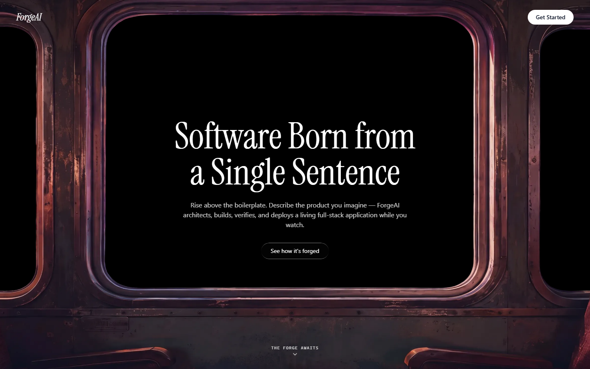
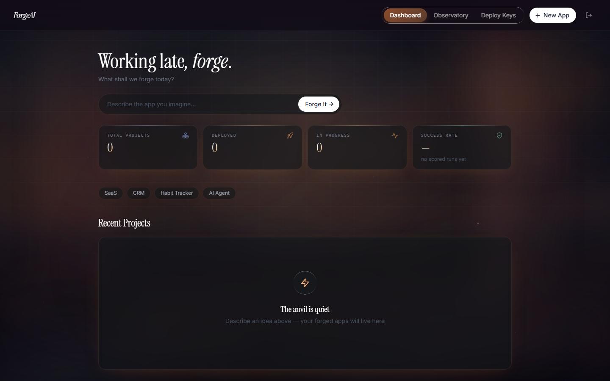
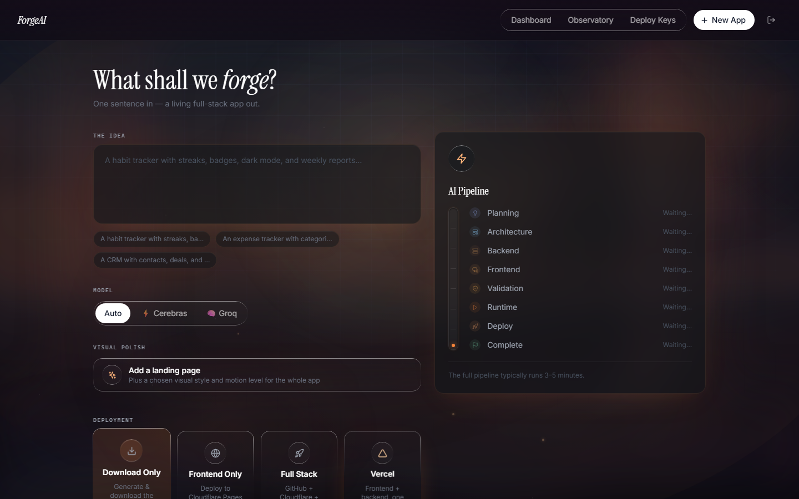
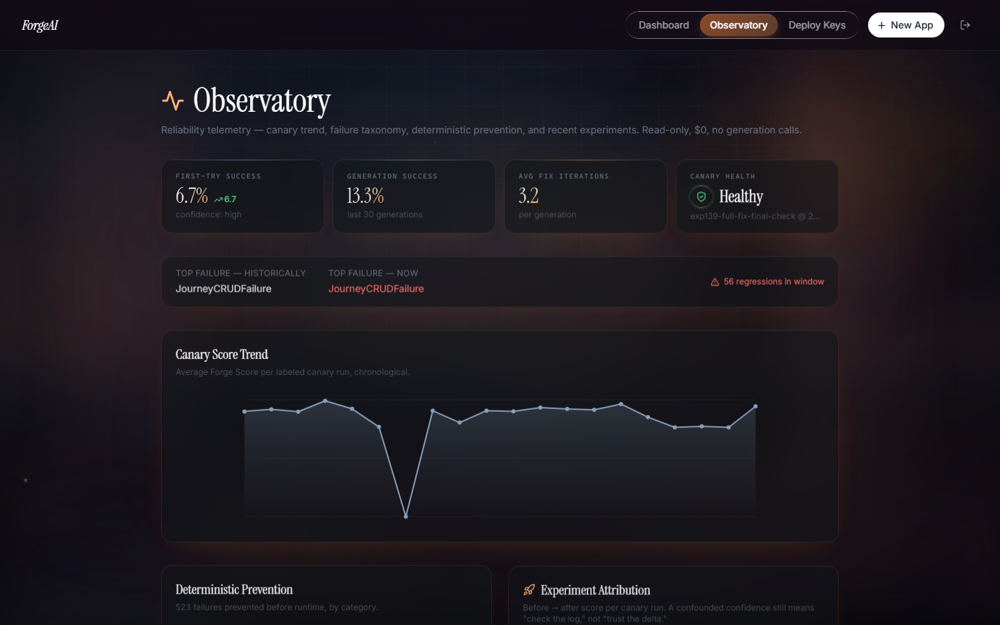

# ForgeAI

AI Software Engineering platform — describe an app in one sentence, get a
complete, verified, deployable full-stack project back.

**Try it live: [forgeai-frontend-wine.vercel.app](https://forgeai-frontend-wine.vercel.app)**
(frontend on Vercel, backend on Railway — same deployment pattern as
[Atlas](https://github.com/Justin300507/atlas), including a real
CRLF-line-ending bug found doing this for real: `start.sh`'s shebang broke
inside the Linux container because the file had Windows line endings from
a prior checkout.)

ForgeAI takes a plain-English product idea and runs it through a
multi-stage pipeline — planning, architecture, parallel backend/frontend
generation, deterministic repair, runtime verification, and optional
deployment — rather than handing back a single unverified LLM completion.

## How it works

1. **Generation (V6 multi-agent team)** — a Product Manager agent turns
   the idea into user stories/entities, an Architect designs the schema
   and routes, a Tech Lead reviews the architecture for security/scaling
   issues, then Backend and Frontend are generated in parallel.
2. **Deterministic Patch** — before any LLM fix call, a library of
   rule-based patchers (`backend/app/services/deterministic_patcher.py`)
   closes known failure classes for free: schema/model nullability
   mismatches, hallucinated model attributes, hyphenated router names,
   missing imports, ORM/response-schema drift, and more.
3. **Verify & Score** — `VerificationEngine` runs static validators,
   contract-conformance checks, a real runtime startup + endpoint smoke
   test, and a CRUD user-journey run (register → login → create → edit →
   delete → verify), rolling everything into a weighted **Forge Score**.
4. **Repair loop** — up to several LLM-driven fix attempts per failure,
   with automatic revert if a "fix" makes things worse, before falling
   back to a broader architecture-repair pass.
5. **Deploy** (optional) — push to GitHub and deploy to Render, Vercel,
   Cloudflare, or Railway directly from the generated project.

Multi-provider LLM routing (OpenAI primary, with Cerebras/Gemini/Groq as
an automatic fallback chain) plus a response cache mean an identical
prompt costs nothing to retry.

## Reliability, honestly

This is an active reliability-engineering project, not just a generator —
the in-app **Observatory** (`/observatory`, public once logged in) shows
real, currently-measured numbers: first-try success rate, generation
success rate, average fix iterations, canary health, and the current
top failure category — not marketing copy. `backend/experiments.md` is a
478K-word paper trail of every reliability experiment run against it.

While building this deployment, a real generation run (a habit tracker
app) surfaced two genuine pipeline bugs, both fixed the same way as
everything else in this repo — root-caused against the actual failure,
regression-tested, then verified against the real, deployed container:

- A deterministic patcher that makes a `*Create` schema's required fields
  match the model's nullability only rewrote single-line `Column(...)`
  declarations — a common LLM formatting choice (one kwarg per line)
  silently defeated it, so the same schema mismatch survived every fix
  attempt across a full regeneration.
- A validator kept re-flagging "invalid model attribute access" even
  after a separate patcher had already wrapped the offending code in a
  safe `try/except`, burning fix-loop budget on an error that could no
  longer actually crash the app.

## Screenshots

| | |
|---|---|
|  |  |
|  |  |

## Tech stack

- **Backend**: FastAPI, SQLAlchemy (SQLite/Postgres), JWT auth,
  WebSocket live generation logs, in-house rate limiting.
- **AI providers**: OpenAI (primary), Cerebras / Gemini / Groq
  (automatic fallback), OpenRouter.
- **Verification**: Playwright-driven runtime and browser checks, a
  static contract-conformance validator, a CRUD user-journey runner.
- **Frontend**: React 18 + Vite, Tailwind CSS, react-router-dom,
  framer-motion, GSAP + Lenis (the landing page's scroll-cinema), Three.js.

## Running it

Backend:
```bash
cd backend
pip install -r requirements.txt
python -m playwright install chromium
export SECRET_KEY=$(python -c "import secrets; print(secrets.token_urlsafe(48))")
export OPENAI_API_KEY=...   # at least one provider key
uvicorn main:app --reload
```
`SECRET_KEY` is the one hard requirement — the app refuses to boot without
an explicit, sufficiently long value (no insecure default). Provider keys
can also be supplied per-user at runtime via the in-app Credentials page
instead of server-side environment variables.

Frontend:
```bash
cd frontend
npm install
npm run dev   # needs VITE_API_URL / VITE_WS_URL pointing at the backend
```

## Project layout

- `backend/app/core/pipeline.py` — `V15Pipeline`, the live generation pipeline.
- `backend/app/verification/engine.py` — static/runtime/browser verification, Forge Score.
- `backend/app/services/deterministic_patcher.py` — the rule-based repair library.
- `backend/app/repair/` — LLM-driven fix orchestration, preflight patchers.
- `backend/failure_memory/` — telemetry backing the Observatory and `experiments.md`.
- `frontend/src/pages/` — Landing, Login/Register, Dashboard, NewProject, ProjectDetail, Observatory, Credentials.

## Limitations

Generation reliability varies by app complexity — the Observatory reports
current real numbers rather than a claimed success rate. LLM-generated
code can still reference fields or endpoints that don't exist; the
deterministic patcher library and verification engine catch most of these
before they reach you, and the two bugs above are examples of exactly that
category being closed for good rather than papered over.
