# ForgeAI Repair Pipeline — Architecture (Post-Consolidation)

Experiment 053 (Repair Pipeline Consolidation), 2026-07-11. Offline, $0,
no generation, no LLM calls, no prompt changes. Direct continuation of
Experiment 051 (`docs/REPAIR_INVENTORY.md`, `docs/REPAIR_GRAPH.md`,
`docs/REPAIR_DEBT.md`) and Experiment 052 (`docs/TEST_COVERAGE_PROGRESS.md`).

**Rule this document follows throughout:** every change described here
was verified by running the actual test suite before and after, not by
inspection alone. Every "no behavior change" claim is backed by a passing
regression test that would fail if the claim were false.

---

## 1. Entry point map

Four dispatch mechanisms coexist (unchanged from Exp051's finding — none
were merged into each other; see §5 for why the registry design in
`docs/REPAIR_REGISTRY.md` doesn't replace any of them yet):

| # | Mechanism | Where | Error isolation | Metrics |
|---|---|---|---|---|
| 1 | Hardcoded sequential list (~40 calls) | `deterministic_patcher.py::run_deterministic_patches` (+ `run_frontend_patches`, called as its last step) | **Added this experiment** (Task 6) — every call now wrapped in `_run_patch_isolated`, was previously unguarded | `counts` dict, one entry per patcher, unchanged shape |
| 2 | Priority-sorted registry | `preflight.py::PreflightRegistry` | Already had per-fix `try/except` (unchanged) | Registry's own bookkeeping (unchanged) |
| 3 | Error-type dict registry | `deployment_fix_service.py` (`_DETERMINISTIC_FIXES`) | Each branch independent by construction (unchanged) | Return value per call (unchanged) |
| 4 | Inline if/elif dispatch | `deployed_fixer.py::fix_deployed_app` | Each branch independent by construction (unchanged) | Return value per call (unchanged) |

Mechanism 1 is the only one that changed this experiment (isolation
added, ordering and every call's arguments unchanged).

## 2. Execution order — unchanged, verified

Full call-by-call order remains exactly as documented in Exp051's
`docs/REPAIR_GRAPH.md` §2-§3 — this experiment did not reorder anything.
The one structural change (Task 6) replaced

```python
counts["_patch_strip_relationships"] = _patch_strip_relationships(root) or 0
```

with

```python
_run_patch_isolated(counts, "_patch_strip_relationships", _patch_strip_relationships, root)
```

for all ~40 calls in that sequence, preserving argument order, call
order, and the `fn(root) or 0` → `counts[key]` convention exactly. The
only behavioral difference is what happens when a call raises (see §4).

## 3. Cleanup / retry stages — where repair fits in the pipeline

```mermaid
flowchart TD
    A[Generation / Regen output] --> B["run_deterministic_patches()<br/>~40 backend patchers, hardcoded order,<br/>NOW: each call isolated (Task 6)"]
    B --> B1["...ends with run_frontend_patches()<br/>14 frontend patchers"]
    B1 --> C["database_patcher.py functions<br/>(called individually, no aggregator)"]
    C --> D["preflight.run()<br/>17 patchers, priority order,<br/>already had per-fix isolation"]
    D --> E[Verification / Runtime check]
    E -->|fails| F{FixOrchestrator}
    F -->|attempt 1-4| G[LLM fix group / module regen]
    F -->|attempt 5, last resort| H["_regenerate_architecture()<br/>Exp048: cache-bypassed"]
    G --> I["run_deterministic_patches() again<br/>(narrower: only patch_database_py,<br/>not the other 5 db patchers)"]
    H --> I
    I --> J["preflight.run() again"]
    J --> E

    K["repair_project()<br/>(standalone repair-only entry point)"] -.Stage 1 now shared.-> B
    K -.Stages 2-3 still separate,<br/>confirmed real divergence.-> F

    style H fill:#4a1f1f
    style I fill:#3a3a1f
    style B fill:#1f3a1f
    style K fill:#1f2a3a
```



Green = changed this experiment (isolation added). Blue = partially
consolidated this experiment (Stage 1 shared, Stages 2-3 deliberately
not).

## 4. Before / after comparison

| Property | Before Exp053 | After Exp053 |
|---|---|---|
| `find_matching_brace`-shaped algorithm | 3 independent implementations (2 in `json_cleaner.py`, 1 in `validator_service.py`) | 1 shared implementation (`app/utils/brace_matching.py`), parameterized by `quote_chars` for the one genuine semantic difference (JSON vs JS/JSX string delimiters) |
| `run_deterministic_patches`'s ~40-call sequence, one call raises | Every subsequent call in the sequence silently never runs; function's return value never reached | The raising call is caught, logged, recorded as count 0; every subsequent call still runs; function returns normally |
| `repair_project()`'s Stage 1 (initial deterministic patch) | Independently duplicated from `generate_project_v6`'s Stage 1 — a future ordering change to one had no structural link to the other | Both call `_run_initial_deterministic_patches()` — one implementation, one place to change |
| `repair_project()`'s Stages 2-3 (arch repair, runtime fix loop) | Structurally similar to the main flow, investigated | **Confirmed real divergence** (main flow gates arch-repair on a `target_files` extraction repair_project() lacks; tracks LLM-call metrics repair_project() doesn't) — left separate, not merged, documented in code and here |
| FastAPI param-order duplication (`deterministic_patcher.py` vs `file_writer_service.py`) | Two implementations | **Still two implementations** — investigated and found genuinely different bracket-tracking (one handles `Dict[str, int]`-shaped type hints in defaults correctly, the other doesn't) — NOT merged, per this experiment's own "do not merge if semantics differ" rule. Flagged as a real bug-fix candidate for a future dedicated Exp052-style cycle, not acted on here. |
| Repair dispatch mechanisms | 4 | 4 (unchanged — see §5) |
| `_patch_relationship_string_aliases` | Called every run, structurally can never find anything (Exp052 finding) | Unchanged — this experiment's scope was infrastructure, not individual patcher logic; still flagged as a live finding in `docs/REPAIR_DEBT.md` |

## 5. Why the registry design (`docs/REPAIR_REGISTRY.md`) doesn't replace mechanism 1

`RepairRegistry` (Task 3) was built and tested as a standalone module,
proven to replicate the properties that matter (priority ordering,
per-entry isolation, the `fn(root) or 0` convention). It was **not**
wired into `run_deterministic_patches`'s live ~40-call sequence, or
`run_frontend_patches`'s 14-call sequence, this cycle.

**Why not:** migrating either of those means replacing a hand-written,
individually-commented sequence — where roughly a dozen of the ~40 calls
have explicit, load-bearing ordering-dependency comments ("must run
before X", "must run after Y", see `docs/REPAIR_GRAPH.md` §2) — with
registration calls carrying `priority=N` numbers that encode the same
constraints. Getting every priority number exactly right, and proving the
migration doesn't silently reorder something, is exactly the kind of
change this experiment's own rule ("any behavioral change requires
explicit evidence and new regression tests") demands real evidence for —
and the only evidence strong enough to trust with the LIVE generation
pipeline is a live canary run, which this offline-only cycle has no
access to (no API, no generation).

Task 6's narrower fix (isolate each call in place, keep the hardcoded
sequence) gets most of the registry's safety benefit — the confirmed
gap Exp051 found (no per-call failure isolation) — without that risk.
The registry is the migration target for a **future** cycle that has
canary access to validate the switch end-to-end, one dispatch mechanism
at a time, starting with whichever has the fewest ordering dependencies
(likely `run_frontend_patches`, which Exp051's audit found has no
*explicitly commented* ordering dependencies among its 14 calls, only
one — `patch_ensure_auth_pages` — with a cross-function dependency
already documented).

## 6. Remaining limitations (Task 6's own scope)

- **`run_frontend_patches`'s 14-call sequence was not given the same
  per-call isolation as `run_deterministic_patches`'s ~40-call sequence.**
  Same gap, same fix would apply (`_run_patch_isolated` is a general
  utility, not specific to the backend list) — not done this cycle, flagged
  for the next.
- **The per-file inline chain** (`run_deterministic_patches`'s first loop,
  11 content-transform patchers chained per `.py` file) still has no
  per-patcher isolation *within* the chain — only the outer file-read has
  a `try/except`. A raising patcher there would still abort processing
  for that one file's remaining transforms (though not the rest of the
  function, since the chain itself isn't in the ~40-call sequence Task 6
  touched). Smaller blast radius (one file, not the whole pipeline) but a
  real, undocumented-until-now gap.
- **Mechanisms 2-4** (preflight's registry, the two dict/if-elif
  dispatchers) already had adequate isolation and were correctly left
  untouched.

## 7. Quantitative summary

```
Duplicated utilities removed:        1  (string-aware brace matcher: 3 -> 1)
Duplicated dispatch paths removed:   0  (see §5 -- registry designed, not migrated)
Duplicated orchestration removed:    1  (repair_project() Stage 1 -- 2 -> 1 implementation)
Shared helpers introduced:           3  (find_matching_brace, _run_patch_isolated,
                                          _run_initial_deterministic_patches)
New standalone infrastructure:       1  (RepairRegistry -- designed + tested, not deployed)
Failure-isolation gaps closed:       1  (run_deterministic_patches's ~40-call sequence)
Failure-isolation gaps confirmed
  still open (documented, not fixed): 2  (run_frontend_patches's 14-call sequence;
                                          the per-file inline chain)
Duplicate implementations investigated
  and NOT merged (semantics differ):  1  (FastAPI param-order fixer --
                                          real bracket-tracking gap found)
Duplicate orchestration investigated
  and NOT merged (semantics differ):  1  (repair_project() Stages 2-3)
New regression tests added:          40  (10 registry design + 20 brace-matching
                                          consolidation + 5 failure isolation +
                                          5 Stage-1 consolidation)
Behavior changes (happy path):        0  (every existing test passes unchanged)
Behavior changes (failure path):      1  (a raising patcher in
                                          run_deterministic_patches's sequence no
                                          longer aborts the rest -- the explicit,
                                          intended, tested change from Task 6)
```

## Methodology note

Every code change in this experiment was verified by: (1) writing a
regression test that fails against the OLD behavior and passes against
the NEW behavior where a real behavior change was intended (Task 6's
isolation), or (2) writing a regression test proving BYTE-IDENTICAL
behavior where none was intended (Tasks 2 and 5's consolidations), then
(3) running the full existing `tests/reliability/` suite (37 files as of
this experiment) plus `tests/adr002/test_orchestrator_wiring.py`
end-to-end and confirming 100% pass, both before touching anything and
after every individual change. Two consolidation candidates (FastAPI
param-order, `repair_project()` Stages 2-3) were investigated with the
same rigor and found to have real semantic differences — documented as
findings, not forced together, per this experiment's own explicit rule.
