# ForgeAI Repair Pipeline — Execution Graph

Experiment 051 (Reliability Debt Audit), 2026-07-11. Read-only investigation,
$0, no generation. Every claim below cites a file:line; anything not
directly quoted from source is explicitly marked **[inferred]**.

This document answers one question: **in what order does ForgeAI's
deterministic + LLM-driven repair machinery actually run, and does any
stage silently depend on an earlier one?** `REPAIR_INVENTORY.md` covers
what each individual function does; `REPAIR_DEBT.md` covers what's risky
about the whole.

---

## 1. The four dispatch mechanisms

ForgeAI does not have one repair-dispatch pattern — it has **four**,
coexisting:

| # | Mechanism | Where | Shape |
|---|-----------|-------|-------|
| 1 | Hardcoded sequential call list | `deterministic_patcher.py::run_deterministic_patches` (line 6220) and `::run_frontend_patches` (line 6186) | ~62 `counts["name"] = _patch_x(root) or 0` lines, in a fixed, hand-maintained order |
| 2 | Priority-sorted registry | `preflight.py::PreflightRegistry` (line 35) | `@preflight.register("name", priority=N)` decorator; `.run()` sorts by priority ascending and calls each |
| 3 | Error-type dict registry | `deployment_fix_service.py` (`_DETERMINISTIC_FIXES`, line 25) | `@_deterministic_fix("ErrorType")` decorator; dispatched by `_DETERMINISTIC_FIXES[error_type](...)` at line 270 |
| 4 | Inline if/elif dispatch | `deployed_fixer.py::fix_deployed_app` (line 179) | Direct `if etype == ...: _fix_x(...)` branches |

**Why this matters for ordering:** mechanism 1 has zero enforced ordering
guarantees beyond "whatever order the lines are written in" — every
ordering dependency in that file is enforced *only* by a human writing the
calls in the right sequence and leaving a comment. Mechanisms 2–4 are
either explicitly ordered (priority number) or order-independent (each
branch is mutually exclusive on `error_type`/`etype`). See `REPAIR_DEBT.md`
for the risk this creates.

---

## 2. `run_deterministic_patches()` — exact call order

Source: `backend/app/services/deterministic_patcher.py:6220-6449`. This is
the single largest and most order-sensitive dispatcher. Sequence exactly as
written in source (comments quoted verbatim where present):

```
Per every *.py file in the project, one file at a time, chained on the same
`patched` string (order matters least here — each is a narrow, non-
overlapping content transform):
 1. _patch_smart_quotes
 2. _patch_wrong_auth_module
 3. _patch_passlib
 4. _patch_pydantic_regex
 5. _patch_func_name_vs_label
 6. _patch_pydantic_orm_mode
 7. _patch_async_sync
 8. _patch_circular_schema_imports
 9. _patch_depends_body
10. _patch_from_orm
11. _patch_orm_response_model

Then, project-wide, in this order:
12. _patch_requirements                          (per requirements.txt)
13. _patch_strip_relationships                    -- "Must run before back_populates strip
                                                       since we remove the whole statement." (line 6279)
14. _patch_strip_back_populates                    -- defensive backstop for #13 (line 6282 comment)
15. _patch_dangling_foreign_keys
16. _patch_deduplicate_models
17. _patch_deduplicate_schemas                     -- "Must run before the import-redirect
                                                       patcher" (line 6292)
18. _patch_model_aliases                           -- "run before FK import patcher" (line 6296)
19. _patch_relationship_string_aliases             -- "must run before FK import patcher" (line 6299)
20. _patch_main_fk_imports                         -- "must run after alias patch" (line 6302),
                                                       depends on #18 + #19
21. _patch_router_names
22. _patch_param_order
23. patch_reorder_shadowed_static_routes
24. _patch_auth_utils          [skipped if skip_protected_injections=True]
25. _patch_auth_requirements   [skipped if skip_protected_injections=True]
26. _patch_auth_routes         [skipped if skip_protected_injections=True]
    (internally may call _patch_forward_role_to_duplicate_registrars — see §4)
27. _patch_redirect_missing_backend_imports        -- "must run before router wiring" (line 6324),
                                                       depends on #26 having injected auth_routes
28. _patch_wire_orphan_routers                     -- "runs after auth_routes injection" (line 6330),
                                                       depends on #26
29. patch_ensure_auth_pages                        -- "must run BEFORE the generic orphan route
                                                       wirer below" (line 6334) -- refers to #31,
                                                       the FRONTEND orphan-route wirer, not #28
30. _patch_dedupe_frontend_imports                 -- "dedupe before the route wirer" (line 6339),
                                                       depends on #31 not yet having run
31. _patch_wire_orphan_frontend_routes
32. _patch_login_redirect_target                   -- "Must run after the line above" (line 6348),
                                                       depends on #31
33. _patch_seed_robustness
34. _patch_create_missing_schemas
35. _patch_response_schemas_optional
36. _patch_response_schema_inherited_required_fields
37. _patch_schema_nullable_required_mismatch
38. _patch_response_schema_id_and_datetimes
39. _patch_schemas_from_attributes
40. _patch_star_dict_extra_fields
41. _patch_unsafe_model_hasattr_filter
42. _patch_filtered_ctor_kwarg_collision
43. _patch_attr_access_mismatches
44. _patch_ownership_fk_attribute_drift
45. _patch_missing_create_update_fields
46. _patch_orm_type_in_route_schemas
47. _patch_missing_pydantic_imports
48. _patch_list_response_model_mismatch
49. _patch_create_missing_service_stubs
50. _patch_missing_db_refresh
51. run_frontend_patches(root)                     -- see §3, runs as the LAST step of this
                                                       function, not a separate top-level stage
```

**Fact:** steps 13→14, 17, 18→19→20, 26→27→28, 29 (vs §3 step), 30→31→32
are the only *explicitly commented* ordering dependencies in this
function. All other adjacent pairs have no stated dependency — **[inferred]**
most are safe because they touch disjoint file sets (e.g. `_patch_router_names`
only touches route files, `_patch_seed_robustness` only touches
`seed_routes.py`), but this was not verified pairwise for all 39 remaining
functions; that would require reading every regex/target-file combination,
out of scope for this pass.

---

## 3. `run_frontend_patches()` — exact call order

Source: `deterministic_patcher.py:6186-6217`. Called as the final step of
`run_deterministic_patches` (see §2 step 51) **and independently** from
`main.py`'s `_resync_frontend` (line 425-451) for the "Check & Fix deployed
app" flow that never touches the backend. The function's own docstring
(line 6188-6200) explains why both call sites are routed through one
function: they drifted apart once already, with two frontend patchers
silently invisible to the standalone resync path.

```
1. _patch_frontend_package_json
2. _patch_disallowed_icon_packages
3. _patch_invalid_lucide_icons
4. _patch_missing_icon_imports
5. _patch_frontend_auth_field_names
6. _patch_frontend_signup_password_key
7. _patch_stale_status_on_error
8. _patch_unsafe_optional_chain_before_array_method
9. _patch_response_data_used_as_bare_array
10. _patch_response_data_assumed_wrapped
11. _patch_hidden_loading_status
12. _patch_pagination_component
13. _patch_broken_template_literal_classnames
14. patch_ensure_auth_pages
```

**Fact:** `patch_ensure_auth_pages` is called here (step 14) **and** again
directly in `run_deterministic_patches` (§2 step 29) — every full
generation that calls `run_deterministic_patches` therefore calls
`patch_ensure_auth_pages` twice per pass. **[inferred]** Not confirmed
harmful — the function's own logic was not read for idempotency in this
pass — but flagged in `REPAIR_DEBT.md` as worth a one-line idempotency
check.

**Fact:** no ordering comments exist between steps 1-13; only step 14 has
one (§2's "must run BEFORE the generic orphan route wirer", which actually
governs step 31 of §2, not anything here — that comment lives at the
*call site* in `run_deterministic_patches`, not in this function).

---

## 4. Nested patcher-calls-patcher

**Fact:** `_patch_auth_routes` (deterministic_patcher.py, exact def line
not re-derived in this pass — see `REPAIR_INVENTORY.md`) calls
`_patch_forward_role_to_duplicate_registrars` directly from inside its own
body, conditionally, at line 2183:

```python
if role_info:
    msg += f" -- role-aware signup, vocabulary={sorted(role_info[1])} default={role_info[0]!r}"
    _patch_forward_role_to_duplicate_registrars(project_path)
```

This is a hidden dependency invisible from `run_deterministic_patches`'s
call list alone — reading §2 you would not know
`_patch_forward_role_to_duplicate_registrars` runs at all, or that it runs
*conditionally* on whether `_patch_auth_routes` detected a non-default
role vocabulary. It has no entry in `run_deterministic_patches`'s `counts`
dict either, so its prevention count is invisible to the reliability
dashboard's `DETERMINISTIC_PREVENTION_CATEGORIES` rollup.

---

## 5. `preflight.run()` — priority order

Source: `backend/app/repair/preflight.py`. 17 functions registered via
`@preflight.register(name, priority=N)`; `.run()` sorts by priority
ascending (line 48) and executes in that order — **not** source-file
order. Execution order (priority in parens):

```
1.  fix_pyjwt (10)
2.  fix_bcrypt (11)
3.  swap_passlib (12)
4.  fix_config_missing_settings_instance (13)
5.  fix_config_missing_attrs (14)
6.  fix_postgres_url (15)
7.  fix_missing_init (20)
8.  fix_query_param_basemodel (22)
9.  fix_frontend_missing_imports (23)
10. fix_model_schema_notnull_gap (24)
11. fix_router_names (25)
12. fix_param_order (26)
13. fix_missing_env (30)
14. fix_strip_passlib_imports (35)
15. fix_cors_missing (40)
16. fix_missing_health_endpoint (45)
17. fix_database_py (50)
```

**Fact, worth flagging explicitly:** in *source line order*,
`fix_postgres_url` (line 176, priority 15) is defined **before**
`fix_config_missing_attrs` (line 206, priority 14) — a reader scanning the
file top-to-bottom would reasonably assume postgres_url runs first. It
does not; priority order overrides source order, so `fix_config_missing_attrs`
actually runs first. This is the kind of thing that only the registry's
own `.run()` reveals — see `REPAIR_DEBT.md` for why this matters.

`preflight.run()` fails soft per-fix (line 60-67: each fix wrapped in its
own `try/except`, a failure is logged and skipped, not fatal to the rest
of the run) — so a broken fix at priority 10 cannot block priority 50 from
running. This is *not* true of `run_deterministic_patches`'s sequential
list in §2, which has no per-call exception isolation — **[inferred]** an
exception partway through that function's body would abort every
subsequent step in the same call. Not confirmed by a runtime test in this
pass; confirmed only by reading the absence of try/except around
individual `_patch_x()` calls in the source (contrast with the per-file
`try/except` at lines 6243-6246, which only guards file *reading*, not the
patcher calls themselves).

---

## 6. Pipeline-level call sites of `run_deterministic_patches`

**Fact:** `run_deterministic_patches` is called from **8** distinct sites
(the function's own docstring at line 6228 says "7 call sites" — a
one-off discrepancy, see `REPAIR_DEBT.md`):

| # | File:line | Context |
|---|-----------|---------|
| 1 | `core/pipeline.py:459` | `V15Pipeline._apply_deterministic_patches` — the **live** pipeline's single initial call, before first verification. Followed by `patch_database_py` + 5 more `database_patcher.py` functions (lines 460-467), then `preflight.run()` (line 470). |
| 2 | `repair/orchestrator.py:1075` | `FixOrchestrator`'s per-fix-attempt cleanup, inside `if all_modified:` — runs after every LLM-driven fix group is applied, followed by `patch_database_py` only (line 1076) and `preflight.run()` (line 1077). **Narrower** than site 1 — see `REPAIR_DEBT.md`. |
| 3 | `services/v6_orchestrator.py:257` | Initial generation, main flow (`_run_frontend`'s sibling code path) |
| 4 | `services/v6_orchestrator.py:639` | After architecture-repair file injection, main flow. `skip_protected_injections=True`. |
| 5 | `services/v6_orchestrator.py:795` | After each LLM runtime fix, main flow |
| 6 | `services/v6_orchestrator.py:1008` | `repair_project()` — a **separate top-level entry point** (repair-only mode, skip generation). Structural mirror of site 3. |
| 7 | `services/v6_orchestrator.py:1161` | After architecture-repair injection, inside `repair_project()`. Structural mirror of site 4. `skip_protected_injections=True`. |
| 8 | `services/v6_orchestrator.py:1188` | After each LLM runtime fix, inside `repair_project()`. Structural mirror of site 5. |

**Fact:** sites 3/4/5 and 6/7/8 are the same three-stage pattern
(initial → after-arch-repair → after-each-runtime-fix) implemented twice,
once for the main generation flow and once for `repair_project()`'s
standalone repair-only flow. See `REPAIR_DEBT.md` for the duplication
this represents.

---

## 7. Mermaid — high-level repair flow

```mermaid
flowchart TD
    A[Generation / Regen output] --> B["run_deterministic_patches()<br/>~50 backend patchers, hardcoded order"]
    B --> B1["...ends with run_frontend_patches()<br/>14 frontend patchers"]
    B1 --> C["database_patcher.py functions<br/>(called individually, no aggregator)"]
    C --> D["preflight.run()<br/>17 patchers, priority order"]
    D --> E[Verification / Runtime check]
    E -->|fails| F{FixOrchestrator}
    F -->|attempt 1-4| G[LLM fix group / module regen]
    F -->|attempt 5, last resort| H["_regenerate_architecture()<br/>Exp048: cache-bypassed"]
    G --> I["run_deterministic_patches() again<br/>(narrower: only patch_database_py,<br/>not the other 5 db patchers)"]
    H --> I
    I --> J["preflight.run() again"]
    J --> E

    style H fill:#4a1f1f
    style I fill:#3a3a1f
```



---

## Methodology note

This document was produced by direct reading of the dispatcher functions
and their call sites — not by running the pipeline. Ordering claims marked
without **[inferred]** are direct quotes or exact transcriptions of source
code; anything else is explicitly labeled. Full per-function detail
(trigger, inputs, outputs, tests) lives in `REPAIR_INVENTORY.md`, not
repeated here.
